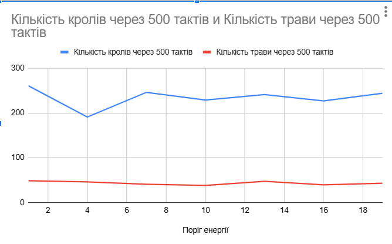

## Комп'ютерні системи імітаційного моделювання
## СПм-23-3, **Сергородцев Ілля Дмитрович**
### Лабораторна робота №**1**. Опис імітаційних моделей та проведення обчислювальних експериментів

 

### Варіант 6, модель у середовищі NetLogo:
[Rabbits Grass Weeds](http://www.netlogoweb.org/launch#http://www.netlogoweb.org/assets/modelslib/Sample%20Models/Biology/Rabbits%20Grass%20Weeds.nlogo)
 

### Вербальний опис моделі:
Модель імітує взаємодію кроликів, трави та бур'янів в екосистемі. У цьому симуляційному середовищі кролики виступають як травоїдні тварини, які харчуються травою для виживання і розмноження. Трава є ресурсом, який відновлюється на певних ділянках після поїдання. Бур'яни, в свою чергу, конкурують із травою за простір і можуть захоплювати ділянки, унеможливлюючи відновлення трави на цих місцях. Модель дозволяє досліджувати, як взаємодія кроликів, трави і бур'янів може впливати на стабільність популяцій і ресурсів в екосистемі.

### Керуючі параметри:
- **number** – кількість кроликів у моделі на початку симуляції.
- **birth-threshold** – поріг енергії, необхідний для того, щоб кролики могли розмножуватися.
- **grass-grow-rate** – швидкість зростання трави. Цей параметр визначає, як часто трава відновлюється на ділянках.
- **grass-energy** – кількість енергії, яку кролик отримує при поїданні трави.
- **weeds-grow-rate** – швидкість зростання бур'янів. Визначає, як часто бур'яни з'являються на ділянках.
- **weed-energy** – енергія, яку кролики отримують від бур'янів

### Внутрішні параметри:
- **energy** – рівень енергії кроликів. Зростає при поїданні трави і знижується з кожним рухом або відсутністю їжі.
- **ticks** – кількість тактів симуляції, що відображає час, який минув з початку моделювання.

### Показники роботи системи:
- поточна кількість кролів на данному такті симуляції.
- поточна кількість трави на данному такті симуляції.
- поточна кількість кролів на данному такті симуляції.

### Примітки:
При спостереженні за монітором COUNT RABBITS та графіком POPULATIONS можна відстежити, як змінюється популяція кроликів з часом. Спочатку трави недостатньо для підтримки численної популяції, тому багато кроликів гинуть. Це дозволяє траві відновитися, створюючи достатньо їжі для тих, хто залишився. Кролики набираються енергії та розмножуються, але зростання популяції призводить до нестачі трави, і цикл повторюється знову.

Популяція кроликів проходить через приглушені коливання, зрештою стабілізуючись у вузькому діапазоні. Загальна кількість трави також коливається, перебуваючи у протифазі до популяції кроликів.

Ці двійні коливання характерні для систем хижак-жертва, які зазвичай описуються диференціальними рівняннями Лотки-Вольтерри.

### Недоліки моделі:
В моделі трава зростає рівномірно після зменшення чисельності кроликів, але в реальних умовах її відновлення може займати більше часу та залежати від інших факторів, таких як сезонні зміни чи погодні умови

Модель розглядає популяції як однорідну масу, не враховуючи індивідуальних відмінностей кроликів, таких як різниця у віці чи здоров’ї, що могло б вплинути на швидкість розмноження та виживання

У моделі кролики втрачають енергію дуже повільно, якщо вони не розмножуються, тоді як при споживанні трави вони отримують значну кількість енергії. Це призводить до накопичення енергії без жодних обмежень, що дозволяє кроликам жити практично нескінченно. Така ситуація є нереалістичною і не враховує природні процеси старіння чи інші фактори, які обмежують тривалість життя тварин.

 

## Обчислювальні експерименти

### 1. Вплив порогу енергії на розмноження кроликів
Дослідження залежності популяції кроликів від значення параметра **birth-threshold**, який визначає кількість енергії, необхідну для того, щоб кролики могли розмножуватися.
model:
- **number**: 150
- **grass-grow-rate**: 15
- **grass-energy**: 5
- **weeds-grow-rate**: 0
- **weed-energy**: 0
- **birth-threshold**: 1, 4, 7, 10, 13, 16, 19  (крок 3)
<table>
    <thead>
        <tr><th>Поріг енергії</th><th>Кількість кролів через 500 тактів</th><th>Кількість трави через 500 тактів</th></tr>
    </thead>
    <tbody>
        <tr><td>1</td><td>261</td><td>48,75</td></tr>
        <tr><td>4</td><td>191</td><td>46</td></tr>
        <tr><td>7</td><td>246</td><td>41</td></tr>
        <tr><td>10</td><td>229</td><td>38,25</td></tr>
        <tr><td>13</td><td>241</td><td>47,5</td></tr>
        <tr><td>16</td><td>227</td><td>39,5</td></tr>
        <tr><td>19</td><td>244</td><td>43</td></tr>
    </tbody>
</table>
У моделі спостерігаються стрибкоподібні зміни в популяції кроликів: чим менше енергії доступно в екосистемі, тим більша амплітуда цих коливань. Це свідчить про нестабільність популяції, яка різко зростає, коли енергії достатньо, і швидко зменшується через дефіцит ресурсів.

### 2. Вплив швидкості зростання трави на популяцію кроликів
model:
- **number**: 150
- **birth-threshold**: 15
- **grass-grow-rate**: 1, 4, 7, 10, 13, 16, 19  (крок 3)
- **grass-energy**: 5
- **weeds-grow-rate**: 0
- **weed-energy**: 0

<table>
    <thead>
        <tr><th>Швидкість росту трави</th><th>Кількість кролів через 500 тактів</th><th>Кількість трави через 500 тактів</th></tr>
    </thead>
    <tbody>
        <tr><td>1</td><td>N/A</td><td>N/A</td></tr>
        <tr><td>4</td><td>62</td><td>46</td></tr>
        <tr><td>7</td><td>115</td><td>42,75</td></tr>
        <tr><td>10</td><td>158</td><td>39</td></tr>
        <tr><td>13</td><td>204</td><td>42,25</td></tr>
        <tr><td>16</td><td>260</td><td>44</td></tr>
        <tr><td>19</td><td>282</td><td>41,75</td></tr>
    </tbody>
</table>

### 3. Вплив бур'янів на енергетичний баланс кроликів

Досліджується, як зміна **weed-grow-rate** та **weed-energy** впливає на енергетичний баланс кроликів та їх здатність до розмноження. В експерименті варіюються ці два параметри для аналізу їхнього впливу на екосистему.
model:
- **number**: 30
- **birth-threshold**: 40
- **grass-grow-rate**: 1
- **grass-energy**: 25
- **weeds-grow-rate**: 1, 4, 7, 10, 13, 16, 19  (крок 3)
- **weed-energy**: 1, 2, 3, 4, 5, 6, 7, 8, 9 (крок 1)
<table>
    <thead>
        <tr><th>Швидкість росту бур'янів</th><th>Енергетична цінність бур'янів</th><th>Кількість кролів через 500 тактів</th><th>Кількість трави через 500 тактів</th><th>Кількість бур'янів через 500 тактів</th></tr>
    </thead>
    <tbody>
        <tr><td>1</td><td>1</td><td>220</td><td>39</td><td>3,5</td></tr>
        <tr><td>4</td><td>2</td><td>255</td><td>36,75</td><td>10,5</td></tr>
        <tr><td>7</td><td>3</td><td>294</td><td>35,5</td><td>13,5</td></tr>
        <tr><td>10</td><td>4</td><td>388</td><td>23</td><td>14</td></tr>
        <tr><td>13</td><td>5</td><td>431</td><td>24</td><td>15</td></tr>
        <tr><td>16</td><td>6</td><td>533</td><td>12,5</td><td>19,75</td></tr>
        <tr><td>19</td><td>7</td><td>660</td><td>10,75</td><td>20</td></tr>
    </tbody>
</table>

